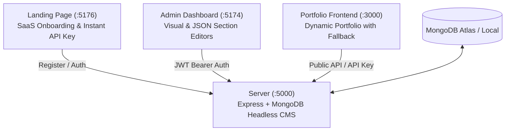

# Portfolio CMS 🚀

A modern, production-ready, **multi-tenant headless CMS** and portfolio ecosystem. Anyone can register, manage portfolio sections (Hero, About, Projects, Skills, Experience, Education, Socials, Services, and custom JSON) via a dedicated admin dashboard, and serve content to any web or mobile frontend via REST APIs or secure API keys.

---

## 🌟 Ecosystem Overview

The project consists of four interconnected applications:



| Sub-project | Description | Stack | Default Port |
| :--- | :--- | :--- | :--- |
| **`server/`** | Headless CMS REST API, Auth & Storage | Node.js (ESM), Express 4, MongoDB (Mongoose), JWT, Multer | `5000` |
| **`frontend/`** | Live developer portfolio client with offline fallback | React 19, React Router 7, Vite 8, Lucide Icons | `3000` |
| **`admin/`** | Multi-portfolio content management dashboard | React 19, React Router 7, Vite 8, Lucide Icons | `5174` |
| **`landing/`** | Marketing & self-serve signup portal | React 19, Vite 8, Lucide Icons | `5176` |

---

## 🚀 Quick Start

### Prerequisites
- **Node.js**: `>= 18.0.0`
- **MongoDB**: Local instance or MongoDB Atlas URI

---

### 1. Server Setup

```bash
cd server
cp .env.example .env     # Update MONGODB_URI, JWT_SECRET
npm install
npm run seed             # Seeds initial admin user + demo portfolio ('gabrial-deora')
npm run dev              # Starts dev server on http://localhost:5000
```

> **Tip:** To clone the demo portfolio's content to a newly registered user account:
> ```bash
> EMAIL=user@example.com npm run seed:user
> # Or overwrite existing sections:
> EMAIL=user@example.com FORCE=1 npm run seed:user
> ```

---

### 2. Frontend Setup (Portfolio)

```bash
cd frontend
cp .env.example .env     # Set VITE_API_URL=http://localhost:5000 and VITE_PORTFOLIO_SLUG=gabrial-deora
npm install
npm run dev              # Starts portfolio on http://localhost:3000
```

---

### 3. Admin Panel Setup

```bash
cd admin
cp .env.example .env     # Set VITE_API_URL=http://localhost:5000
npm install
npm run dev              # Starts admin dashboard on http://localhost:5174
```

---

### 4. Landing Page Setup

```bash
cd landing
cp .env.example .env     # Set VITE_API_URL=http://localhost:5000 and VITE_ADMIN_URL=http://localhost:5174
npm install
npm run dev              # Starts landing page on http://localhost:5176
```

---

## 📂 Project Structure

```
Portfolio/
├── server/                         # Headless CMS Backend
│   ├── src/
│   │   ├── config/                 # DB connection, Env parser, Multer upload config
│   │   ├── controllers/            # Auth, Portfolio, Section, API Key controllers
│   │   ├── data/                   # Default seed portfolio data
│   │   ├── middleware/             # JWT auth, API key auth, Rate limiting, Error handlers
│   │   ├── models/                 # User, Portfolio, Section, ApiKey (Mongoose Schemas)
│   │   ├── routes/                 # Express route definitions
│   │   ├── utils/                  # Slugifier, API key generation (crypto)
│   │   ├── index.js                # App entrypoint & middleware pipeline
│   │   ├── seed.js                 # Database seeder (Admin & Demo)
│   │   └── seedToUser.js           # Content duplication script for users
│   └── uploads/                    # Local asset storage for image uploads
│
├── frontend/                       # Client Portfolio Application
│   ├── public/                     # Static icons, favicons & hero image
│   └── src/
│       ├── api/                    # Lightweight API client
│       ├── components/             # Hero, About, Experience, Projects, Skills, Hackathons, Navbar, Footer
│       ├── data/                   # Offline fallback data (Site, Experience, Projects, etc.)
│       ├── hooks/                  # usePortfolioData, useDarkSections, useScrollReveal
│       ├── pages/                  # Home.jsx (Dynamic landing & live preview)
│       └── App.jsx                 # Routing configuration
│
├── admin/                          # Content Management Dashboard
│   └── src/
│       ├── admin/
│       │   ├── components/         # ItemModal, JsonEditor, StructuredEditor, ConfirmDialog, Toast
│       │   ├── AuthContext.jsx     # User authentication state & token persistence
│       │   ├── ProtectedRoute.jsx  # Route guard for authenticated admin routes
│       │   └── structuredSchemas.js# Dynamic form schemas for all section types
│       ├── api/                    # Full-featured API client with token interceptors
│       ├── pages/admin/            # Dashboard, Sections, SectionEditor, ApiKeys, Settings, Login
│       └── App.jsx                 # Admin routes setup
│
└── landing/                        # Marketing & Onboarding Portal
    └── src/
        ├── api/                    # Registration & initial API key generation client
        ├── pages/                  # Landing.jsx (Product introduction & onboarding form)
        └── App.jsx                 # Landing entry
```

---

## 📊 Data Models

* **User**: `email`, `password` (bcrypt-hashed), `name`, `role` (`admin` | `editor`), `isActive`, `lastLogin`.
* **Portfolio**: `slug` (unique identifier), `name`, `owner` (`User` reference), `settings` (arbitrary design/meta JSON), `isActive`.
* **Section**: `portfolio` (`Portfolio` reference), `key` (unique per portfolio, e.g. `projects`, `experience`), `label`, `content` (flexible JSON), `order`, `isPublished`.
* **ApiKey**: `owner` (`User` reference), `portfolio` (`Portfolio` reference), `name`, `prefix`, `keyHash` (SHA-256), `lastUsedAt`, `isActive`.

---

## 🔌 API Reference

All API responses follow the standard format:
```json
{ "success": true, "data": { ... } }
```
Errors return:
```json
{ "success": false, "error": "Description", "details": [] }
```

### 1. Portfolio Content API (API Key Auth Required)
Open CORS enabled. Authenticate with API key via `Authorization: Bearer <key>` or `x-api-key: <key>`.

| Method | Path | Description |
| :--- | :--- | :--- |
| `GET` | `/api/v1/portfolio` | Retrieve portfolio settings and all published sections |
| `GET` | `/api/v1/section/:key` | Retrieve a single section by key |
| `GET` | `/health` | Server uptime and health status |

---

### 2. Portfolio Management API (API Key Auth Required)
Authenticate using any of:
- `Authorization: Bearer <apiKey>`
- `x-api-key: <apiKey>`
- `?api_key=<apiKey>`

| Method | Path | Description |
| :--- | :--- | :--- |
| `GET` | `/api/v1/portfolio` | Retrieve full portfolio and published sections for the key's portfolio |
| `GET` | `/api/v1/section/:key` | Retrieve specific section content via API key |

---

### 3. Authentication Endpoints

| Method | Path | Payload | Description |
| :--- | :--- | :--- | :--- |
| `POST` | `/api/auth/register` | `{ email, password, name, portfolioName? }` | Registers user, generates default portfolio & returns initial plaintext API key |
| `POST` | `/api/auth/login` | `{ email, password }` | Authenticates user and returns JWT token |
| `GET` | `/api/auth/me` | _Header: Bearer JWT_ | Returns current authenticated user and their portfolios |

---

### 4. Owner / Management Endpoints (JWT Required)

#### Portfolios (`/api/portfolios`)
- `GET /` — List user's portfolios
- `POST /` — Create a new portfolio (`{ name, slug? }`)
- `GET /:id` — Get portfolio details
- `PUT /:id` — Update portfolio name or slug
- `DELETE /:id` — Delete a portfolio and its sections
- `GET /:id/settings` / `PUT /:id/settings` — Get / Update portfolio settings JSON

#### Sections (`/api/portfolios/:portfolioId/sections`)
- `GET /` — List all sections for a portfolio
- `POST /` — Create a new section (`{ key, label, content, order, isPublished }`)
- `GET /:sectionId` — Get section details
- `PUT /:sectionId` — Update section content, label, or publication status
- `DELETE /:sectionId` — Remove a section
- `PUT /order/reorder` — Update section display order (`{ ids: [...] }`)

#### API Keys (`/api/api-keys`)
- `GET /` — List active API keys (returns prefix, name, usage timestamps)
- `POST /` — Create an API key for a portfolio (`{ portfolioId, name? }`)
- `DELETE /:id` — Revoke / delete an API key

#### Uploads (`/api/uploads`)
- `POST /` — Upload image file (`multipart/form-data`, 5MB limit, PNG/JPG/SVG/WEBP)

---

## ⚙️ Environment Variables Reference

### `server/.env`
| Variable | Required | Default | Description |
| :--- | :--- | :--- | :--- |
| `PORT` | No | `5000` | Port for Express server |
| `NODE_ENV` | No | `development` | Environment (`development` or `production`) |
| `MONGODB_URI` | Yes | — | MongoDB connection string |
| `JWT_SECRET` | Yes | `dev-secret-change-me` | Secret key for JWT signing |
| `JWT_EXPIRES_IN` | No | `24h` | JWT token lifespan |
| `SEED_ADMIN_EMAIL` | No | `admin@gabrialdeora.com` | Seed admin email address |
| `SEED_ADMIN_PASSWORD` | No | `ChangeMe123!` | Seed admin password |

### `frontend/.env`
| Variable | Default | Description |
| :--- | :--- | :--- |
| `VITE_API_URL` | `http://localhost:5000` | Backend API base URL |
| `VITE_PORTFOLIO_SLUG` | `gabrial-deora` | Default portfolio slug to fetch |
| `VITE_API_KEY` | _optional_ | API key for authenticated `/api/v1` data fetching |

### `admin/.env`
| Variable | Default | Description |
| :--- | :--- | :--- |
| `VITE_API_URL` | `http://localhost:5000` | Backend API base URL |
| `VITE_PORTFOLIO_SLUG` | `gabrial-deora` | Default slug for live preview links |

### `landing/.env`
| Variable | Default | Description |
| :--- | :--- | :--- |
| `VITE_API_URL` | `http://localhost:5000` | Backend API base URL |
| `VITE_ADMIN_URL` | `http://localhost:5174` | Admin dashboard URL for post-signup redirect |
| `VITE_PORTFOLIO_SLUG` | `gabrial-deora` | Demo slug featured on landing page |

---

## 🚢 Deployment

### Backend (e.g. Render, Railway, VPS)
1. Provision a MongoDB instance on MongoDB Atlas.
2. Configure build command: `npm install`
3. Configure start command: `npm start`
4. Set required production environment variables (`MONGODB_URI`, `JWT_SECRET`, `NODE_ENV=production`).
5. Run `npm run seed` once to initialize the administrator account.

### Frontends (e.g. Vercel, Netlify, Cloudflare Pages)
Deploy each frontend app independently:
- **Frontend Portfolio**: Root directory `frontend`, build command `npm run build`, output directory `dist`. Set `VITE_API_URL` to your production server URL.
- **Admin Panel**: Root directory `admin`, build command `npm run build`, output directory `dist`. Set `VITE_API_URL`.
- **Landing Page**: Root directory `landing`, build command `npm run build`, output directory `dist`. Set `VITE_API_URL` and `VITE_ADMIN_URL`.

---

## 📜 Available NPM Scripts

| Location | Command | Purpose |
| :--- | :--- | :--- |
| `server` | `npm run dev` | Run server in watch mode |
| `server` | `npm run seed` | Seed superadmin and initial demo data |
| `server` | `npm run seed:user` | Populate a user account with sample sections |
| `frontend` | `npm run dev` / `npm run build` | Start portfolio dev server / build for production |
| `admin` | `npm run dev` / `npm run build` | Start admin panel dev server / build for production |
| `landing` | `npm run dev` / `npm run build` | Start landing page dev server / build for production |

---

## 📄 License

MIT © [Gabrial Deora](https://github.com/Gabrial-8467)
